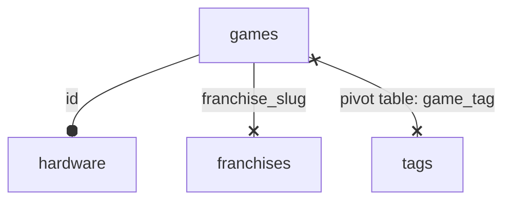
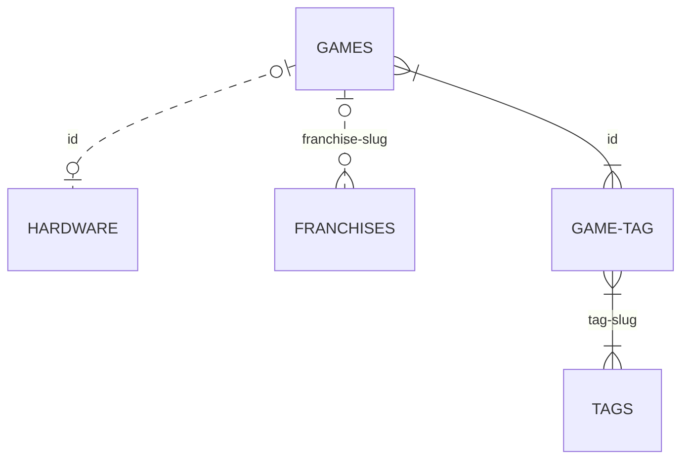
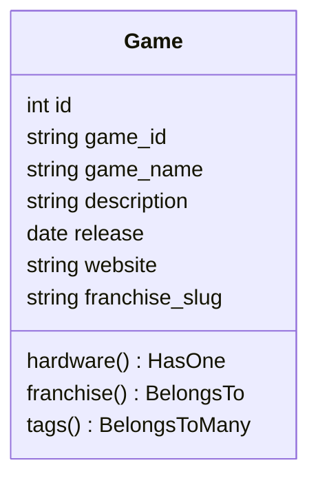
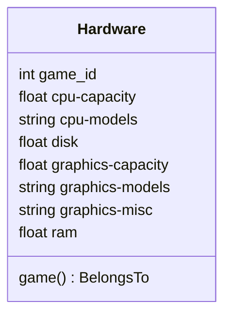
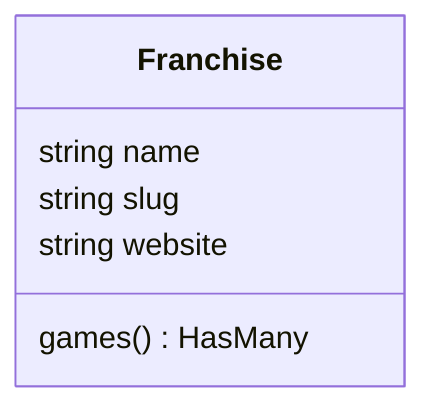
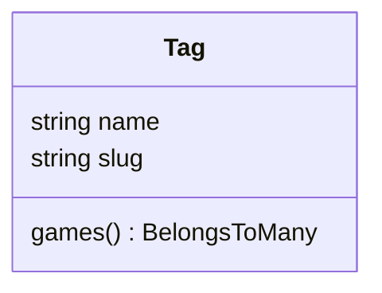

*Example based on [**./play.it API**](https://forge.dotslashplay.it/play.it/api)*

## 1. Difference between *Model* and *Table*

Laravel has ORM system called Eloquent, an ORM is an Object Relationships Mapping. In one way, we have *migrations* to create database tables in MySQL for example. In other way, we have *models* to represent each entity in a PHP object. In a Controller, we call model if we want to get database content and not directly table.

```php[app/Http/Controllers/AnyController.php]
<?php

namespace App\Http\Controllers;

use App\Http\Controllers\Controller;
use Illuminate\Support\Facades\DB;

use App\Models\User;

class AnyController extends Controller
{
  public function index()
  {
    // with Laravel raw SQL query
    $users = DB::select('select * from users where active = ?', [1]);

    // with Laravel Eloquent ORM
    $users = User::where('active', 1)->get();
  }
}
```

At l. 13, we call directly table `users` from database and we bypass ORM system, like old PHP apps before ORM. But the real interest to use Laravel is to call Model **User**, l. 17, which is a class object in PHP, that we define before setup controllers, to define each attribute which in the `users` table.

<spoiler label="Example of User model">

```php[app/Models/User.php]
<?php

namespace App\Models;

use Illuminate\Database\Eloquent\Model;

/**
 * App\User
 */
class User extends Model
{
  protected $table = 'users';
  protected $fillable = [
    'username',
    'email',
    'password',
    'active'
  ];
}
```

</spoiler>

<spoiler label="Example of users table">

```php[database/migrations/2020_05_24_174020_create_users_table.php]
<?php

use Illuminate\Database\Migrations\Migration;
use Illuminate\Database\Schema\Blueprint;
use Illuminate\Support\Facades\Schema;

class CreateUsersTable extends Migration
{
  /**
  * Run the migrations.
  *
  * @return void
  */
  public function up()
  {
    Schema::create('users', function (Blueprint $table) {
      $table->increments('id');
      $table->string('username')->unique();
      $table->string('email')->unique();
      $table->string('password');
      $table->boolean('active')->default(false);
      $table->rememberToken();
      $table->timestamps();
    });
  }

  /**
    * Reverse the migrations.
    *
    * @return void
    */
  public function down()
  {
    Schema::dropIfExists('forum_users');
  }
}
```

</spoiler>

**Why?**

To use Eloquent ORM, we need to define database tables into migrations AND Models. We can think it's take more time than just a raw SQL query. But Models are really powerfull when we have to get data, to save data, to use relationships between tables, use getters/setters or more complex problems.

**Relationships**

MySQL allow tables to have relationships like OneToOne, OneToMany or ManyToMany. So you will have to create these relationships into migrations files for MySQL. But for Models, you will have to recreate these relationships with Eloquent ORM syntax to manipulate each entity with relationships if you want it.
When migrations and models have right syntax, you can call any entity with relationships with a extremely simple syntax like below

```php[app/Http/Controllers/AnyController.php]
<?php

// Here with take the example of a Game with some relationships
// Just with Eloquent $games contain all games and each game have hardware, tags and franchise relationship just with Eloquent ORM

class MyController extends Contoller
{
  public function index {
    $games = Game::with('hardware', 'tags', 'franchise')->get();
  }
}
```

If you have to call `games` table and make all junctions to have same results in MySQL, it's would be very exhausted. This is the goal of Eloquent: make any manipulation of database very easy with objects.

---

:::tip Example with Game entity

Let's take a **Game** entity. It's a Laravel Model and PHP object with some attributes like `game_id`, `game_name`, `description`... But, like any game, it has a **Hardware** minimal configuration, a potentially **Franchise** and some **Tag**s associated with. So we have **OneToOne** relationship between *one* **Game** and *one* **Hardware**, **OneToMany** relationship between *one* **Franchise** and potentially *many* **Games** and **ManyToMany** relationship between *many* **Tags** and *many* **Games** (for this relationship, we will have to create a pivot table).

In this example, we could add **Hardware** attributes to **Game** entity but hardware is specific attributes, we don't need any time, we choose to check it if necessary but not every time we just need `game_name` for example. It's OneToOne relationship just to outsource hardware config in another table.
:::

---

## 2. Database

:::details Overview of database

You can find below three view for the *same* database, just with different presentations

#### Flowchart view



#### Entity relationship view



To design theses charts, I use [**mermaidjs**](https://mermaid-js.github.io/mermaid/#/) and it's not possible to use `_` for table names, so I replace it with `-`

#### phpMyAdmin view


:::

:::tip
To create this database, we need to create migrations with Laravel, to make navigation easy, just content of `up()` methods is display, you can check migration with detail panel.
:::

### 2. a. `franchises` table: OneToMany Relationships

`franchises` table have to be created *before* `games` table because `games` table contain foreign key of `franchises`. We can add columns to an existant migration but it's an update migration and it's more specific, here we weill stay on simple case.

```php
Schema::create('franchises', function (Blueprint $table): void {
 $table->string('slug')->unique()->index();
    $table->string('name');
    $table->string('website')->nullable();
});
```

:::details Complete migration for franchises table
<vue-code-info ext="php" path="database/migrations/2020_04_07_053742_create_franchises_table.php">

```php
<?php

use Illuminate\Support\Facades\Schema;
use Illuminate\Database\Schema\Blueprint;
use Illuminate\Database\Migrations\Migration;

class CreateFranchisesTable extends Migration {
 /**
  * Run the migrations.
  *
  * @return void
  */
 public function up(): void {
  Schema::create('franchises', function (Blueprint $table): void {
   $table->string('slug')->unique()->index();
   $table->string('name');
   $table->string('website')->nullable();
  });
 }

 /**
  * Reverse the migrations.
  *
  * @return void
  */
 public function down(): void {
  Schema::dropIfExists('franchises');
 }
}
```

</vue-code-info>
:::

### 2. b. `games` table: main table

In this table, we have a foreign key of `franchises` table, a previous created table.

```php
Schema::create('games', function (Blueprint $table): void {
  $table->increments('id');
  $table->string('game_id');
  $table->string('game_name')->unique();
  $table->string('game_name_slug');
  $table->json('description')->nullable();
  $table->date('release')->nullable();
  $table->string('website')->nullable();
  $table->string('franchise_slug')->index()->nullable();
   $table->foreign('franchise_slug')
    ->references('slug')
    ->on('franchises')
    ->onDelete('cascade');
});
```

:::details Complete migration for games table
<vue-code-info ext="php" path="database/migrations/2020_05_08_200000_create_games_images_table.php">

```php
<?php

use Illuminate\Support\Facades\Schema;
use Illuminate\Database\Schema\Blueprint;
use Illuminate\Database\Migrations\Migration;

class CreateGamesTable extends Migration {
 /**
  * Run the migrations.
  *
  * @return void
  */
 public function up(): void {
  Schema::create('games', function (Blueprint $table): void {
   $table->increments('id');
   $table->string('game_id');
   $table->string('game_name')->unique();
   $table->string('game_name_slug');
   $table->json('description')->nullable();
   $table->date('release')->nullable();
   $table->string('website')->nullable();
      $table->string('franchise_slug')->index()->nullable();
   $table->foreign('franchise_slug')
    ->references('slug')
    ->on('franchises')
    ->onDelete('cascade');
  });
 }

 /**
  * Reverse the migrations.
  *
  * @return void
  */
 public function down(): void {
  Schema::dropIfExists('games');
 }
}
```

</vue-code-info>
:::

### 2. c. `tags` table: ManyToMany Relationship

The `tags` table

```php
Schema::create('tags', function (Blueprint $table): void {
 $table->string('slug')->unique()->index();
    $table->string('name');
});
```

:::details Complete migration for tags table
<vue-code-info ext="php" path="database/migrations/2020_07_18_053809_create_tags_table.php">

```php
<?php

use Illuminate\Support\Facades\Schema;
use Illuminate\Database\Schema\Blueprint;
use Illuminate\Database\Migrations\Migration;

class CreateTagsTable extends Migration {
 /**
  * Run the migrations.
  *
  * @return void
  */
 public function up(): void {
  Schema::create('tags', function (Blueprint $table): void {
   $table->string('slug')->unique()->index();
   $table->string('name');
  });
 }

 /**
  * Reverse the migrations.
  *
  * @return void
  */
 public function down(): void {
  Schema::dropIfExists('tags');
 }
}
```

</vue-code-info>
:::

And `game_tag` table, pivot table between with `games`

```php
Schema::create('game_tag', function (Blueprint $table): void {
 $table->unsignedInteger('game_id')->index();
    $table->foreign('game_id')
        ->references('id')
        ->on('games')
        ->onDelete('cascade');
    $table->string('tag_slug')->index();
    $table->foreign('tag_slug')
        ->references('slug')
        ->on('tags')
        ->onDelete('cascade');
});
```

:::details Complete migration for game_tag table
<vue-code-info ext="php" path="database/migrations/2020_07_18_053856_add_relationship_between_games_and_tags.php">

```php
<?php

use Illuminate\Support\Facades\Schema;
use Illuminate\Database\Schema\Blueprint;
use Illuminate\Database\Migrations\Migration;

class AddRelationshipBetweenGamesAndTags extends Migration {
 /**
  * Run the migrations.
  *
  * @return void
  */
 public function up(): void {
  Schema::create('game_tag', function (Blueprint $table): void {
   $table->unsignedInteger('game_id')->index();
   $table->foreign('game_id')
    ->references('id')
    ->on('games')
    ->onDelete('cascade');
   $table->string('tag_slug')->index();
   $table->foreign('tag_slug')
    ->references('slug')
    ->on('tags')
    ->onDelete('cascade');
  });
 }

 /**
  * Reverse the migrations.
  *
  * @return void
  */
 public function down(): void {
  Schema::dropIfExists('game_tag');
 }
}
```

</vue-code-info>
:::

### 2. d. `hardware` table: OneToOne Relationship

```php
Schema::create('hardware', function (Blueprint $table): void {
 $table->unsignedInteger('game_id')->index();
    $table->foreign('game_id')
        ->references('id')
        ->on('games')
        ->onDelete('cascade');
    $table->float('cpu-capacity', 4, 2)->nullable();
    $table->string('cpu-models')->nullable();
    $table->float('disk', 4, 2)->nullable();
    $table->float('graphics-capacity', 4, 3)->nullable();
    $table->string('graphics-models')->nullable();
    $table->string('graphics-misc')->nullable();
    $table->float('ram', 4, 2)->nullable();
});
```

:::details Complete migration for hardware table
<vue-code-info ext="php" path="database/migrations/2020_07_18_053823_create_hardware_table.php">

```php
<?php

use Illuminate\Support\Facades\Schema;
use Illuminate\Database\Schema\Blueprint;
use Illuminate\Database\Migrations\Migration;

class CreateHardwareTable extends Migration {
 /**
  * Run the migrations.
  *
  * @return void
  */
 public function up(): void {
  Schema::create('hardware', function (Blueprint $table): void {
   $table->unsignedInteger('game_id')->index();
   $table->foreign('game_id')
    ->references('id')
    ->on('games')
    ->onDelete('cascade');
   $table->float('cpu-capacity', 4, 2)->nullable();
   $table->string('cpu-models')->nullable();
   $table->float('disk', 4, 2)->nullable();
   $table->float('graphics-capacity', 4, 3)->nullable();
   $table->string('graphics-models')->nullable();
   $table->string('graphics-misc')->nullable();
   $table->float('ram', 4, 2)->nullable();
  });
 }

 /**
  * Reverse the migrations.
  *
  * @return void
  */
 public function down(): void {
  Schema::dropIfExists('hardware');
 }
}
```

</vue-code-info>
:::

---

## 3. Models

We will define models for Eloquent, it's just PHP class that extends `Model`, it's a magic class of Laravel to associate all manipulation methods to any Model.

:::details Overview of models diagrams
If you want to have diagrams before design classes, you can find it below, but all classes are available after that.









:::

### 3. a. Game Model

Game model refer to `games` table, it's on it we have all relationships.

```php
class Game extends Model {

    protected $table = 'games';
    protected $fillable = [
        'game_id',
        'game_name',
        'description',
        'release',
        'website',
    ];

    public function tags(): BelongsToMany {
        return $this->belongsToMany(Tag::class, 'game_tag');
    }
    public function hardware(): HasOne {
        return $this->hasOne(Hardware::class);
    }
    public function franchise(): BelongsTo {
        return $this->belongsTo(Franchise::class);
    }
}
```

:::details Complete model for Game
<vue-code-info ext="php" path="app/Models/Game.php">

```php
<?php

namespace App\Models;

use Illuminate\Database\Eloquent\Model;

class Game extends Model {

    protected $table = 'games';
    protected $fillable = [
        'game_id',
        'game_name',
        'description',
        'release',
        'website',
    ];

 /**
  * ===============
  *  Relationships
  * ===============.
  *
  * - tags: ManyToMany,
  * - hardware: OneToOne,
  * - franchise: OneToMany
  */

 /**
  * Relation ManyToMany with Tag::class.
  *
  * Pivot table: game_tag
  *
  * Foreign key game_id from games.id / tag_slug from tags.slug
  *
  * @return BelongsToMany
  */
 public function tags(): BelongsToMany {
  return $this->belongsToMany(Tag::class, 'game_tag');
 }

 /**
  * Relation OneToOne with Hardware::class.
  *
  * Foreign key game_id from games.id
  *
  * @return HasOne
  */
 public function hardware(): HasOne {
  return $this->hasOne(Hardware::class);
 }

 /**
  * Relation OneToMany with Franchise::class, one game can belongs to one franchise and one franchise can belongs to many games.
  *
  * Foreign key franchise_slug in games from franchises.slug
  *
  * @return BelongsTo
  */
 public function franchise(): BelongsTo {
  return $this->belongsTo(Franchise::class);
 }
}
```

</vue-code-info>
:::

### 3. b. Hardware Model

```php
class Hardware extends Model {

    protected $table = 'hardware';
    protected $fillable = [
  'game_id',
  'cpu-capacity',
  'cpu-models',
  'disk',
  'graphics-capacity',
  'graphics-models',
  'graphics-misc',
  'ram',
 ];

 public function game(): BelongsTo {
  return $this->belongsTo(Game::class, 'game_name');
 }
}
```

:::details Complete model for Hardware
<vue-code-info ext="php" path="app/Models/Hardware.php">

```php
<?php

namespace App\Models;

use Illuminate\Database\Eloquent\Model;

class Hardware extends Model {

    protected $table = 'hardware';
    protected $fillable = [
  'game_id',
  'cpu-capacity',
  'cpu-models',
  'disk',
  'graphics-capacity',
  'graphics-models',
  'graphics-misc',
  'ram',
 ];

 /**
  * Relation OneToOne with Game::class.
  *
  * Foreign key game_id from games.id
  *
  * @return BelongsTo
  */
 public function game(): BelongsTo {
  return $this->belongsTo(Game::class, 'game_name');
 }
}
```

</vue-code-info>
:::

### 3. c. Franchise Model

```php
class Franchise extends Model {

    protected $primaryKey = 'slug';
 protected $keyType = 'string';

 protected $fillable = [
  'name',
  'slug',
  'website',
 ];

 public function games(): HasMany {
  return $this->hasMany(Game::class);
 }
}
```

:::details Complete model for Franchise
<vue-code-info ext="php" path="app/Models/Franchise.php">

```php
<?php

namespace App\Models;

use Illuminate\Database\Eloquent\Model;

class Franchise extends Model {
 /**
  * @var string
  */
 protected $primaryKey = 'slug';

 /**
  * Database primary key type should be explicitely declared if it is not an integer.
  *
  * @var string
  */
 protected $keyType = 'string';

 /**
  * @var array<string>
  */
 protected $fillable = [
  'name',
  'slug',
  'website',
 ];

 /**
  * Relation ManyToMany with Game:class.
  *
  * Pivot table: game_franchise
  *
  * Foreign key game_id from games.id / franchise_slug from franchises.slug
  *
  * @return HasMany
  */
 public function games(): HasMany {
  return $this->hasMany(Game::class);
 }
}
```

</vue-code-info>
:::

### 3. d. Tag Model

```php
class Tag extends Model {

    protected $primaryKey = 'slug';
 protected $keyType = 'string';

 protected $fillable = [
  'name',
  'slug',
    ];

 public function games(): BelongsToMany {
  return $this->belongsToMany(Game::class, 'game_tag');
 }
}
```

:::details Complete model for Tag
<vue-code-info ext="php" path="app/Models/Tag.php">

```php
<?php

namespace App\Models;

use Illuminate\Database\Eloquent\Model;

class Tag extends Model {
 /**
  * @var string
  */
 protected $primaryKey = 'slug';

 /**
  * Database primary key type should be explicitely declared if it is not an integer.
  *
  * @var string
  */
 protected $keyType = 'string';

 /**
  * @var array<string>
  */
 protected $fillable = [
  'name',
  'slug',
 ];

 /**
  * Relation ManyToMany with Game:class.
  *
  * Pivot table: game_tag
  *
  * Foreign key game_id from games.id / tag_slug from tags.slug
  *
  * @return BelongsToMany
  */
 public function games(): BelongsToMany {
  return $this->belongsToMany(Game::class, 'game_tag');
 }
}
```

</vue-code-info>
:::

---

## 4. Controllers

And now, in *any* controller, you can call *any* model with relationships.

```php
<?php

namespace App\Http\Controllers;

use App\Http\Controllers\Controller;

use App\Models\Game;

class MyController extends Controller
{
  public function index()
  {
    // all games without relationships
    $games = Game::all();
    // all games with relationships
    $games_with_relationships = Game::with('hardware','franchise','tags')->get();
    // all tags with their games
    $tags_with_games = Tag::with('games')->get();
  }
}
```

---

## Example

```bash
game_id: "the-elder-scrolls-3-morrowind"
game_name: "The Elder Scrolls III: Morrowind"
description: "In the waning years of the Third Era of Tamriel, a prisoner born on a certain day to uncertain parents was sent under guard, without explanation, to Morrowind, ignorant of the role he was to play in that nation's history..."
website: "https://elderscrolls.bethesda.net/en/morrowind"
franchise_slug: "the-elder-scrolls"
```

```bash
game_id: 22
cpu-capacity: 0.50
cpu-models: "Intel Pentium III Celeron / AMD Athlon"
disk: 1.0
graphics-capacity: 0.030
graphics-models: null
graphics-misc: "Direct3D, 32-bit color, DirectX 8.1"
ram: 0.26
```
